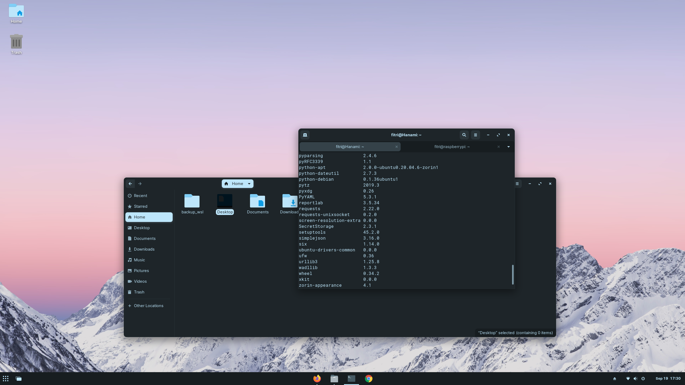

Title:How to Learn Code Fast
Date: 2020-12-03 10:20
Modified: 2020-12-05 19:30
Category: Python
Tags: pelican, publishing
Slug: my-super-post
Authors: Fitri Rahim
Summary: Short version for index and feeds

Well, short answer you simply don't. For this to work you need time to learn. 

Coding is not just learning about the syntaxes, it's also about solving problems.

There's certain aspect of solving the problem with coding you need can't learn simply by following courses, you need experience and gain experience, you need to sit down, learn and configuring stuff on your own.

That's a very simple advise, sit down and learn, but I'm sure not many people able to do it nowdays.

With rise of short content from TikTok, attention span became shorter, and majority of us are with or without conscience are consuming this short content which in turn shorten our attention span by a lot. 

Sitting down and learning might not be a popular method, but it's a proven one. Take a an hour or so each day, step by step and before we know it, we already doing better than we are before. 

Try it!!
